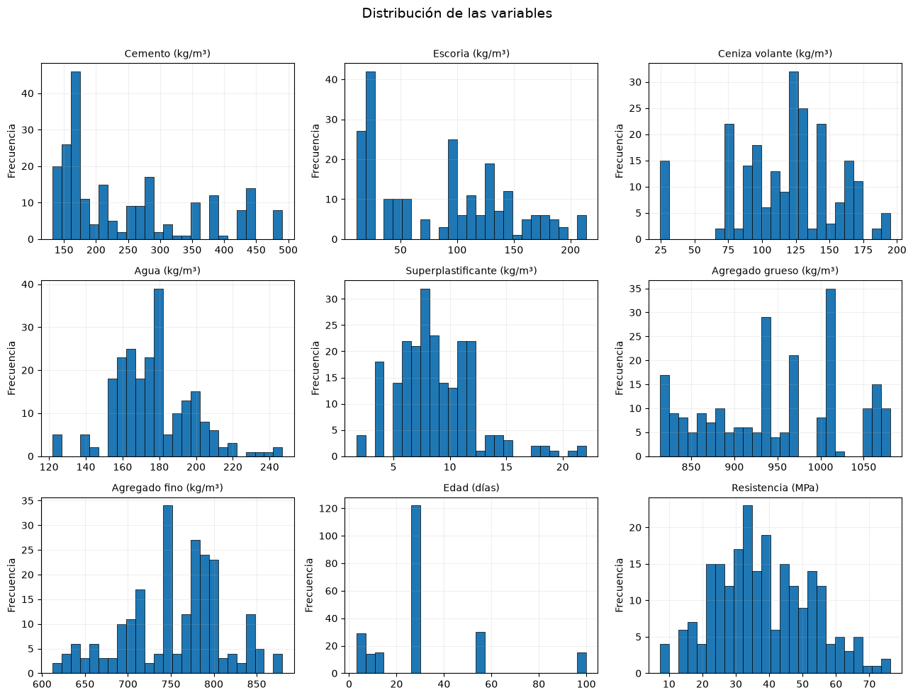
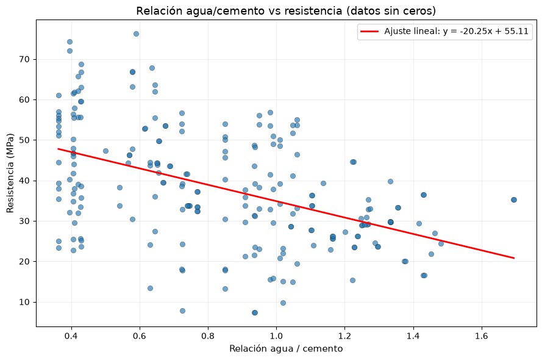
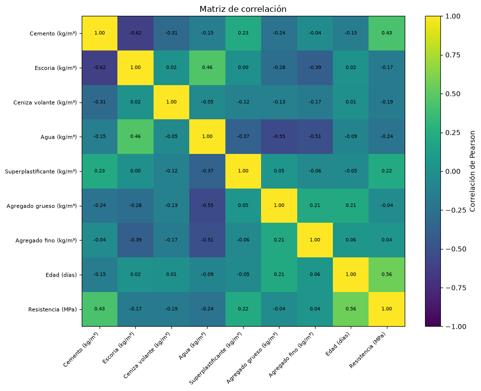
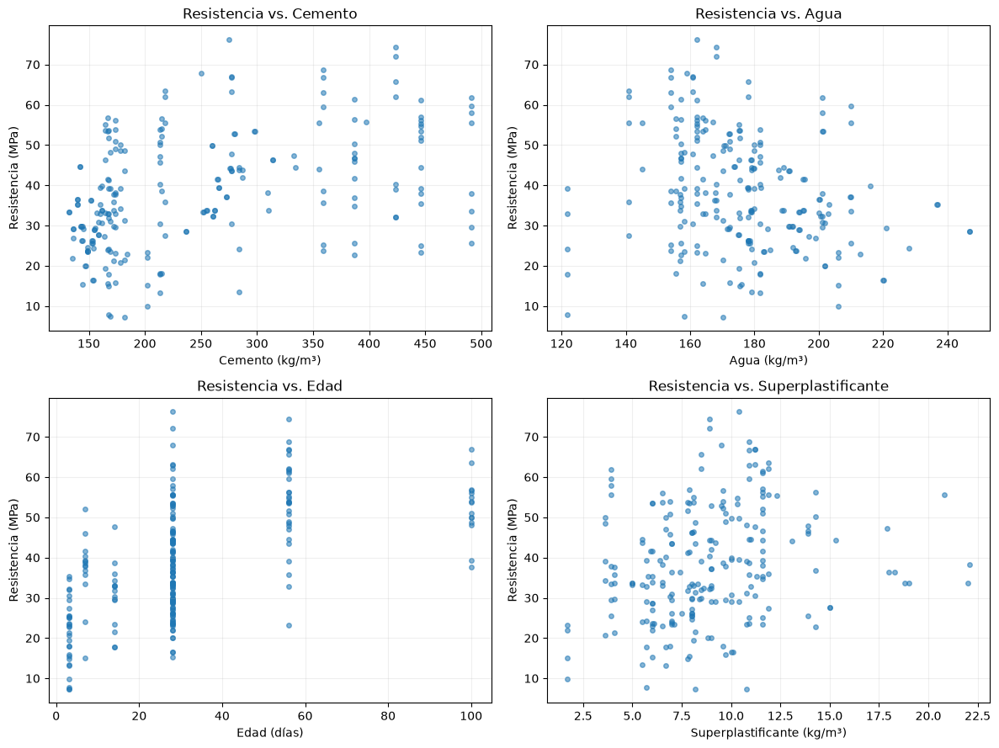
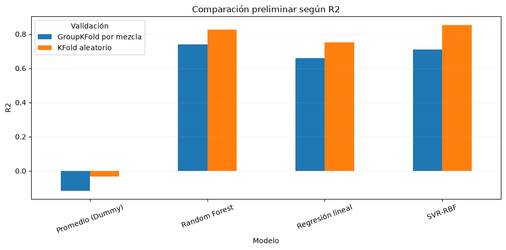
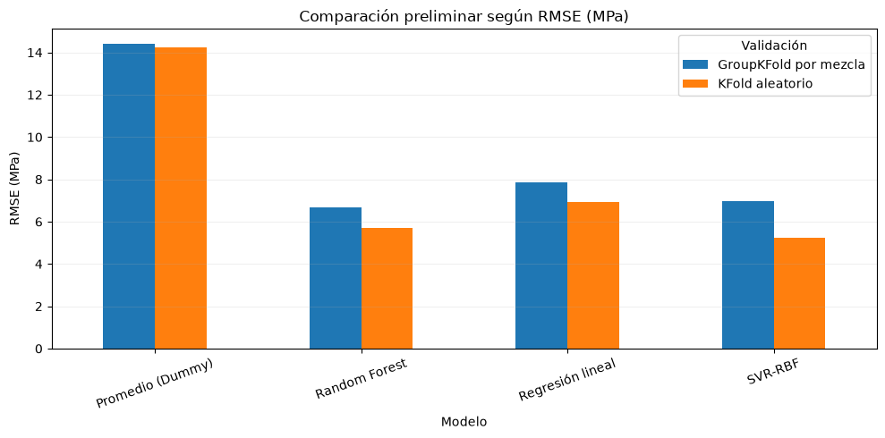

# T2: Análisis Exploratorio y Plan Algorítmico
## Predicción de la resistencia a compresión del concreto — Grupo 03

**Objetivo del T2:** verificar la calidad del conjunto de datos, documentar las decisiones de limpieza, efectuar un análisis exploratorio y definir los modelos de regresión y las métricas que se utilizarán.

**Fuente oficial:** Yeh, I.-C. (1998). *Concrete Compressive Strength* [Dataset]. UCI Machine Learning Repository. DOI: 10.24432/C5PK67.

El conjunto tiene **1030 observaciones**, **8 variables predictoras cuantitativas** y **1 variable objetivo cuantitativa**. La tarea es de **regresión**.


## 1. Librerías y configuración reproducible


```python
from pathlib import Path
import warnings
warnings.filterwarnings('ignore')

import numpy as np
import pandas as pd
import matplotlib.pyplot as plt

from sklearn.model_selection import KFold, GroupKFold, cross_validate
from sklearn.pipeline import Pipeline
from sklearn.preprocessing import StandardScaler
from sklearn.linear_model import LinearRegression, LogisticRegression
from sklearn.ensemble import RandomForestRegressor, RandomForestClassifier
from sklearn.svm import SVR
from sklearn.neural_network import MLPRegressor
from sklearn.dummy import DummyRegressor, DummyClassifier
from sklearn.inspection import permutation_importance
from sklearn.metrics import classification_report

RANDOM_STATE = 42
pd.set_option('display.max_columns', 30)
pd.set_option('display.float_format', lambda x: f'{x:,.3f}')

```

## 2. Carga e identificación del conjunto de datos


```python
# El notebook busca primero una copia local, lo que facilita subirlo a GitHub.
# Si no la encuentra, usa una copia pública del mismo dataset UCI.
candidates = [
    Path('concrete.csv'),
    Path('data/concrete.csv'),
    Path('/mnt/data/concrete.csv'),
]

for path in candidates:
    if path.exists():
        DATA_PATH = path
        break
else:
    DATA_PATH = 'https://raw.githubusercontent.com/stedy/Machine-Learning-with-R-datasets/master/concrete.csv'

df = pd.read_csv(DATA_PATH)
print('Fuente leída:', DATA_PATH)
print('Dimensiones:', df.shape)
df.head()

```

    Fuente leída: https://raw.githubusercontent.com/stedy/Machine-Learning-with-R-datasets/master/concrete.csv
    Dimensiones: (1030, 9)
    


<div>
<style scoped>
    .dataframe tbody tr th:only-of-type {
        vertical-align: middle;
    }

    .dataframe tbody tr th {
        vertical-align: top;
    }

    .dataframe thead th {
        text-align: right;
    }
</style>
<table border="1" class="dataframe">
  <thead>
    <tr style="text-align: right;">
      <th></th>
      <th>cement</th>
      <th>slag</th>
      <th>ash</th>
      <th>water</th>
      <th>superplastic</th>
      <th>coarseagg</th>
      <th>fineagg</th>
      <th>age</th>
      <th>strength</th>
    </tr>
  </thead>
  <tbody>
    <tr>
      <th>0</th>
      <td>540.000</td>
      <td>0.000</td>
      <td>0.000</td>
      <td>162.000</td>
      <td>2.500</td>
      <td>1,040.000</td>
      <td>676.000</td>
      <td>28</td>
      <td>79.990</td>
    </tr>
    <tr>
      <th>1</th>
      <td>540.000</td>
      <td>0.000</td>
      <td>0.000</td>
      <td>162.000</td>
      <td>2.500</td>
      <td>1,055.000</td>
      <td>676.000</td>
      <td>28</td>
      <td>61.890</td>
    </tr>
    <tr>
      <th>2</th>
      <td>332.500</td>
      <td>142.500</td>
      <td>0.000</td>
      <td>228.000</td>
      <td>0.000</td>
      <td>932.000</td>
      <td>594.000</td>
      <td>270</td>
      <td>40.270</td>
    </tr>
    <tr>
      <th>3</th>
      <td>332.500</td>
      <td>142.500</td>
      <td>0.000</td>
      <td>228.000</td>
      <td>0.000</td>
      <td>932.000</td>
      <td>594.000</td>
      <td>365</td>
      <td>41.050</td>
    </tr>
    <tr>
      <th>4</th>
      <td>198.600</td>
      <td>132.400</td>
      <td>0.000</td>
      <td>192.000</td>
      <td>0.000</td>
      <td>978.400</td>
      <td>825.500</td>
      <td>360</td>
      <td>44.300</td>
    </tr>
  </tbody>
</table>
</div>


### Diccionario de variables

| Variable | Rol | Unidad | Descripción |
|---|---|---|---|
| cement | Predictora | kg/m³ | Contenido de cemento |
| slag | Predictora | kg/m³ | Escoria granulada de alto horno |
| ash | Predictora | kg/m³ | Ceniza volante |
| water | Predictora | kg/m³ | Agua |
| superplastic | Predictora | kg/m³ | Superplastificante |
| coarseagg | Predictora | kg/m³ | Agregado grueso |
| fineagg | Predictora | kg/m³ | Agregado fino |
| age | Predictora | días | Edad de curado |
| strength | Objetivo | MPa | Resistencia a compresión del concreto |

Los valores cero de escoria, ceniza volante o superplastificante representan **ausencia del componente** y no se consideran valores perdidos.


## 3. Auditoría de calidad y limpieza


```python
quality = pd.DataFrame({
    'tipo': df.dtypes.astype(str),
    'nulos': df.isna().sum(),
    'valores_unicos': df.nunique(),
    'mínimo': df.min(),
    'máximo': df.max(),
})
quality

```


<div>
<style scoped>
    .dataframe tbody tr th:only-of-type {
        vertical-align: middle;
    }

    .dataframe tbody tr th {
        vertical-align: top;
    }

    .dataframe thead th {
        text-align: right;
    }
</style>
<table border="1" class="dataframe">
  <thead>
    <tr style="text-align: right;">
      <th></th>
      <th>tipo</th>
      <th>nulos</th>
      <th>valores_unicos</th>
      <th>mínimo</th>
      <th>máximo</th>
    </tr>
  </thead>
  <tbody>
    <tr>
      <th>cement</th>
      <td>float64</td>
      <td>0</td>
      <td>278</td>
      <td>102.000</td>
      <td>540.000</td>
    </tr>
    <tr>
      <th>slag</th>
      <td>float64</td>
      <td>0</td>
      <td>185</td>
      <td>0.000</td>
      <td>359.400</td>
    </tr>
    <tr>
      <th>ash</th>
      <td>float64</td>
      <td>0</td>
      <td>156</td>
      <td>0.000</td>
      <td>200.100</td>
    </tr>
    <tr>
      <th>water</th>
      <td>float64</td>
      <td>0</td>
      <td>195</td>
      <td>121.800</td>
      <td>247.000</td>
    </tr>
    <tr>
      <th>superplastic</th>
      <td>float64</td>
      <td>0</td>
      <td>111</td>
      <td>0.000</td>
      <td>32.200</td>
    </tr>
    <tr>
      <th>coarseagg</th>
      <td>float64</td>
      <td>0</td>
      <td>284</td>
      <td>801.000</td>
      <td>1,145.000</td>
    </tr>
    <tr>
      <th>fineagg</th>
      <td>float64</td>
      <td>0</td>
      <td>302</td>
      <td>594.000</td>
      <td>992.600</td>
    </tr>
    <tr>
      <th>age</th>
      <td>int64</td>
      <td>0</td>
      <td>14</td>
      <td>1.000</td>
      <td>365.000</td>
    </tr>
    <tr>
      <th>strength</th>
      <td>float64</td>
      <td>0</td>
      <td>845</td>
      <td>2.330</td>
      <td>82.600</td>
    </tr>
  </tbody>
</table>
</div>


```python
print('Total de valores nulos:', int(df.isna().sum().sum()))
print('Filas duplicadas exactas:', int(df.duplicated().sum()))
print('Registros totales:', len(df))

zero_counts = (df == 0).sum()
zero_summary = pd.DataFrame({
    'ceros': zero_counts,
    'pct_ceros': 100 * zero_counts / len(df)
}).sort_values('pct_ceros', ascending=False)
print('\nCeros por variable:')
print(zero_summary)

# Limpieza: retirar filas con cualquier cero en las características
df_original = df.copy()
zero_mask = (df == 0).any(axis=1)
removed = zero_mask.sum()
df = df.loc[~zero_mask].reset_index(drop=True).copy()
print('\nRegistros eliminados con al menos un 0:', removed)
print('Registros tras limpieza:', len(df))
print('Proporción eliminada: {:.1f}%'.format(100 * removed / len(df_original)))

mix_cols = ['cement','slag','ash','water','superplastic','coarseagg','fineagg']
print('Composiciones de mezcla únicas (sin considerar edad):', df[mix_cols].drop_duplicates().shape[0])

```

    Total de valores nulos: 0
    Filas duplicadas exactas: 25
    Registros totales: 1030
    
    Ceros por variable:
                  ceros  pct_ceros
    ash             566     54.951
    slag            471     45.728
    superplastic    379     36.796
    cement            0      0.000
    water             0      0.000
    coarseagg         0      0.000
    fineagg           0      0.000
    age               0      0.000
    strength          0      0.000
    
    Registros eliminados con al menos un 0: 805
    Registros tras limpieza: 225
    Proporción eliminada: 78.2%
    Composiciones de mezcla únicas (sin considerar edad): 120
    

### Decisión sobre duplicados

Se identifican filas exactamente repetidas. No se eliminan de manera automática porque pueden corresponder a réplicas experimentales válidas. Sin embargo, un reparto aleatorio podría ubicar observaciones de la misma mezcla en entrenamiento y prueba, produciendo una evaluación demasiado optimista. Para aplicar el principio de **estabilidad PCS**, se realizarán dos comprobaciones:

1. **KFold aleatorio**, comparable con gran parte de la literatura.
2. **GroupKFold por composición de mezcla**, que impide que una misma dosificación aparezca simultáneamente en entrenamiento y prueba.

Además, se compararán resultados con y sin duplicados exactos como análisis de sensibilidad.


## 4. Estadística descriptiva


```python
df.describe().T

```


<div>
<style scoped>
    .dataframe tbody tr th:only-of-type {
        vertical-align: middle;
    }

    .dataframe tbody tr th {
        vertical-align: top;
    }

    .dataframe thead th {
        text-align: right;
    }
</style>
<table border="1" class="dataframe">
  <thead>
    <tr style="text-align: right;">
      <th></th>
      <th>count</th>
      <th>mean</th>
      <th>std</th>
      <th>min</th>
      <th>25%</th>
      <th>50%</th>
      <th>75%</th>
      <th>max</th>
    </tr>
  </thead>
  <tbody>
    <tr>
      <th>cement</th>
      <td>225.000</td>
      <td>250.212</td>
      <td>106.433</td>
      <td>132.000</td>
      <td>167.000</td>
      <td>213.800</td>
      <td>314.000</td>
      <td>491.000</td>
    </tr>
    <tr>
      <th>slag</th>
      <td>225.000</td>
      <td>86.446</td>
      <td>58.341</td>
      <td>11.000</td>
      <td>24.000</td>
      <td>97.000</td>
      <td>129.900</td>
      <td>214.000</td>
    </tr>
    <tr>
      <th>ash</th>
      <td>225.000</td>
      <td>117.048</td>
      <td>38.544</td>
      <td>24.500</td>
      <td>94.000</td>
      <td>122.000</td>
      <td>141.000</td>
      <td>195.000</td>
    </tr>
    <tr>
      <th>water</th>
      <td>225.000</td>
      <td>176.358</td>
      <td>21.303</td>
      <td>121.800</td>
      <td>162.000</td>
      <td>175.100</td>
      <td>190.600</td>
      <td>247.000</td>
    </tr>
    <tr>
      <th>superplastic</th>
      <td>225.000</td>
      <td>8.820</td>
      <td>3.467</td>
      <td>1.700</td>
      <td>6.500</td>
      <td>8.400</td>
      <td>10.900</td>
      <td>22.100</td>
    </tr>
    <tr>
      <th>coarseagg</th>
      <td>225.000</td>
      <td>946.156</td>
      <td>78.637</td>
      <td>814.000</td>
      <td>879.600</td>
      <td>942.000</td>
      <td>1,006.300</td>
      <td>1,080.800</td>
    </tr>
    <tr>
      <th>fineagg</th>
      <td>225.000</td>
      <td>755.317</td>
      <td>58.367</td>
      <td>612.000</td>
      <td>712.000</td>
      <td>764.400</td>
      <td>793.500</td>
      <td>880.000</td>
    </tr>
    <tr>
      <th>age</th>
      <td>225.000</td>
      <td>31.071</td>
      <td>23.754</td>
      <td>3.000</td>
      <td>14.000</td>
      <td>28.000</td>
      <td>28.000</td>
      <td>100.000</td>
    </tr>
    <tr>
      <th>strength</th>
      <td>225.000</td>
      <td>38.302</td>
      <td>14.220</td>
      <td>7.320</td>
      <td>28.630</td>
      <td>36.440</td>
      <td>48.670</td>
      <td>76.240</td>
    </tr>
  </tbody>
</table>
</div>


## 5. Distribuciones


```python
labels = {
    'cement': 'Cemento (kg/m³)', 'slag': 'Escoria (kg/m³)',
    'ash': 'Ceniza volante (kg/m³)', 'water': 'Agua (kg/m³)',
    'superplastic': 'Superplastificante (kg/m³)',
    'coarseagg': 'Agregado grueso (kg/m³)',
    'fineagg': 'Agregado fino (kg/m³)', 'age': 'Edad (días)',
    'strength': 'Resistencia (MPa)'
}

images_dir = Path('resultados/imagenes')
images_dir.mkdir(parents=True, exist_ok=True)


fig, axes = plt.subplots(3, 3, figsize=(13, 10))
for ax, col in zip(axes.ravel(), df.columns):
    ax.hist(df[col], bins=25, edgecolor='black', linewidth=0.5)
    ax.set_title(labels[col], fontsize=10)
    ax.set_ylabel('Frecuencia')
    ax.grid(alpha=0.2)
fig.suptitle('Distribución de las variables', fontsize=14)
fig.tight_layout(rect=(0, 0, 1, 0.97))
plt.savefig(images_dir / 'distribucion_variables.png', dpi=300)
plt.show()

# Gráfico adicional: relación agua/cemento vs resistencia en datos limpiados
ratio_wc = df['water'] / df['cement']
corr_ratio = np.corrcoef(ratio_wc, df['strength'])[0, 1]
fig, ax = plt.subplots(figsize=(9, 6))
ax.scatter(ratio_wc, df['strength'], alpha=0.65, edgecolor='black', linewidth=0.3)
coef, intercept = np.polyfit(ratio_wc, df['strength'], 1)
x_line = np.linspace(ratio_wc.min(), ratio_wc.max(), 100)
ax.plot(x_line, coef * x_line + intercept, color='red', linewidth=2, label=f'Ajuste lineal: y = {coef:.2f}x + {intercept:.2f}')
ax.set_xlabel('Relación agua / cemento', fontsize=11)
ax.set_ylabel('Resistencia (MPa)', fontsize=11)
ax.set_title('Relación agua/cemento vs resistencia (datos sin ceros)', fontsize=13)
ax.grid(alpha=0.2)
ax.legend()
fig.tight_layout()
plt.savefig(images_dir / 'agua_cemento_vs_resistencia.png', dpi=300)
plt.show()
print(f'Correlación entre agua/cemento y resistencia: {corr_ratio:.3f}')

```


    

    


    

    


    Correlación entre agua/cemento y resistencia: -0.474
    

### Interpretación de las distribuciones y la relación agua/cemento
La figura de distribuciones muestra que algunas variables del concreto tienen valores concentrados en cero (p. ej., superplastificante), mientras que otras tienen rangos amplios y asimetrías pronunciadas. Esto sugiere que los modelos deberán manejar tanto conjuntos de datos con ceros válidos como posibles efectos no lineales.

El gráfico de relación agua/cemento frente a resistencia confirma la tendencia esperada: a mayor razón agua/cemento, la resistencia tiende a disminuir. La correlación calculada indica el grado de asociación, pero los resultados del modelo deben validar si esta razón es un predictor sólido en presencia de los demás componentes de la mezcla.

**Hallazgos iniciales:** la edad, la escoria, la ceniza volante y el superplastificante presentan asimetría y concentración de valores en cero. Esto es coherente con mezclas que no incorporan determinados materiales suplementarios. La resistencia se distribuye entre valores bajos y altos, con una media cercana a 36 MPa.


```python

```

## 6. Valores atípicos mediante la regla del rango intercuartílico


```python
q1 = df.quantile(0.25)
q3 = df.quantile(0.75)
iqr = q3 - q1
outlier_mask = (df < (q1 - 1.5 * iqr)) | (df > (q3 + 1.5 * iqr))
outliers = pd.DataFrame({
    'cantidad': outlier_mask.sum(),
    'porcentaje': 100 * outlier_mask.mean()
}).sort_values('cantidad', ascending=False)
outliers

```


<div>
<style scoped>
    .dataframe tbody tr th:only-of-type {
        vertical-align: middle;
    }

    .dataframe tbody tr th {
        vertical-align: top;
    }

    .dataframe thead th {
        text-align: right;
    }
</style>
<table border="1" class="dataframe">
  <thead>
    <tr style="text-align: right;">
      <th></th>
      <th>cantidad</th>
      <th>porcentaje</th>
    </tr>
  </thead>
  <tbody>
    <tr>
      <th>age</th>
      <td>45</td>
      <td>20.000</td>
    </tr>
    <tr>
      <th>superplastic</th>
      <td>8</td>
      <td>3.556</td>
    </tr>
    <tr>
      <th>water</th>
      <td>4</td>
      <td>1.778</td>
    </tr>
    <tr>
      <th>cement</th>
      <td>0</td>
      <td>0.000</td>
    </tr>
    <tr>
      <th>ash</th>
      <td>0</td>
      <td>0.000</td>
    </tr>
    <tr>
      <th>slag</th>
      <td>0</td>
      <td>0.000</td>
    </tr>
    <tr>
      <th>coarseagg</th>
      <td>0</td>
      <td>0.000</td>
    </tr>
    <tr>
      <th>fineagg</th>
      <td>0</td>
      <td>0.000</td>
    </tr>
    <tr>
      <th>strength</th>
      <td>0</td>
      <td>0.000</td>
    </tr>
  </tbody>
</table>
</div>


Los valores extremos no se eliminarán únicamente por una regla estadística. En este dataset pueden representar edades prolongadas, mezclas de alto desempeño o dosificaciones técnicamente posibles. Se revisarán mediante análisis de sensibilidad y residuos del modelo.


## 7. Correlación y relaciones bivariadas


```python
corr = df.corr(numeric_only=True)
fig, ax = plt.subplots(figsize=(10, 8))
im = ax.imshow(corr.values, aspect='auto', vmin=-1, vmax=1)
ax.set_xticks(range(len(corr.columns)), [labels[c] for c in corr.columns], rotation=45, ha='right', fontsize=8)
ax.set_yticks(range(len(corr.index)), [labels[c] for c in corr.index], fontsize=8)
for i in range(corr.shape[0]):
    for j in range(corr.shape[1]):
        ax.text(j, i, f'{corr.iloc[i, j]:.2f}', ha='center', va='center', fontsize=7)
fig.colorbar(im, ax=ax, label='Correlación de Pearson')
ax.set_title('Matriz de correlación')
fig.tight_layout()
plt.savefig(images_dir / 'matriz_correlacion.png', dpi=300)
plt.show()

```


    

    


```python
corr['strength'].sort_values(ascending=False).to_frame('correlación_con_resistencia')

```


<div>
<style scoped>
    .dataframe tbody tr th:only-of-type {
        vertical-align: middle;
    }

    .dataframe tbody tr th {
        vertical-align: top;
    }

    .dataframe thead th {
        text-align: right;
    }
</style>
<table border="1" class="dataframe">
  <thead>
    <tr style="text-align: right;">
      <th></th>
      <th>correlación_con_resistencia</th>
    </tr>
  </thead>
  <tbody>
    <tr>
      <th>strength</th>
      <td>1.000</td>
    </tr>
    <tr>
      <th>age</th>
      <td>0.559</td>
    </tr>
    <tr>
      <th>cement</th>
      <td>0.428</td>
    </tr>
    <tr>
      <th>superplastic</th>
      <td>0.221</td>
    </tr>
    <tr>
      <th>fineagg</th>
      <td>0.042</td>
    </tr>
    <tr>
      <th>coarseagg</th>
      <td>-0.036</td>
    </tr>
    <tr>
      <th>slag</th>
      <td>-0.173</td>
    </tr>
    <tr>
      <th>ash</th>
      <td>-0.186</td>
    </tr>
    <tr>
      <th>water</th>
      <td>-0.236</td>
    </tr>
  </tbody>
</table>
</div>


```python
fig, axes = plt.subplots(2, 2, figsize=(12, 9))
for ax, col in zip(axes.ravel(), ['cement', 'water', 'age', 'superplastic']):
    ax.scatter(df[col], df['strength'], alpha=0.55, s=16)
    ax.set_xlabel(labels[col])
    ax.set_ylabel(labels['strength'])
    ax.set_title(f'Resistencia vs. {labels[col].split(" (")[0]}')
    ax.grid(alpha=0.2)
fig.tight_layout()
plt.savefig(images_dir / 'resistencia_vs_variables.png', dpi=300)
plt.show()

```


    

    


La correlación lineal muestra una asociación positiva moderada de la resistencia con el cemento, el superplastificante y la edad, y una asociación negativa con el agua. Los diagramas de dispersión ilustran que estas relaciones no son estrictamente lineales y que existe dispersión en los datos, lo que justifica el uso de modelos no lineales como Random Forest, SVR con kernel RBF y redes neuronales. En conjunto, la matriz de correlación y las gráficas bivariadas permiten validar que hay señales útiles para predecir la resistencia sin depender únicamente de una sola variable.

### Conclusión general de los gráficos
En conjunto, los gráficos muestran que el conjunto de datos presenta señal predictiva para la resistencia del concreto, con relaciones claramente visibles entre varios predictores y la variable objetivo. La presencia de valores cero y la dispersión en las relaciones sugieren que los modelos deben manejar no linealidades y diferentes escalas, mientras que los patrones de correlación sirven como validación inicial de las variables más relevantes. Este análisis respalda el uso de modelos robustos y la inclusión de variables ingenieriles para mejorar la capacidad predictiva.

## 8. Ingeniería de variables con fundamento técnico


```python
def add_engineered_features(X: pd.DataFrame) -> pd.DataFrame:
    X = X.copy()
    X['binder'] = X['cement'] + X['slag'] + X['ash']
    X['water_binder'] = X['water'] / X['binder']
    X['water_cement'] = X['water'] / X['cement']
    X['aggregate_total'] = X['coarseagg'] + X['fineagg']
    X['aggregate_binder'] = X['aggregate_total'] / X['binder']
    X['sp_binder'] = X['superplastic'] / X['binder']
    X['age_log'] = np.log1p(X['age'])
    return X

X_raw = df.drop(columns='strength')
y = df['strength']
X_eng = add_engineered_features(X_raw)
X_eng.head()

```


<div>
<style scoped>
    .dataframe tbody tr th:only-of-type {
        vertical-align: middle;
    }

    .dataframe tbody tr th {
        vertical-align: top;
    }

    .dataframe thead th {
        text-align: right;
    }
</style>
<table border="1" class="dataframe">
  <thead>
    <tr style="text-align: right;">
      <th></th>
      <th>cement</th>
      <th>slag</th>
      <th>ash</th>
      <th>water</th>
      <th>superplastic</th>
      <th>coarseagg</th>
      <th>fineagg</th>
      <th>age</th>
      <th>binder</th>
      <th>water_binder</th>
      <th>water_cement</th>
      <th>aggregate_total</th>
      <th>aggregate_binder</th>
      <th>sp_binder</th>
      <th>age_log</th>
    </tr>
  </thead>
  <tbody>
    <tr>
      <th>0</th>
      <td>168.000</td>
      <td>42.100</td>
      <td>163.800</td>
      <td>121.800</td>
      <td>5.700</td>
      <td>1,058.700</td>
      <td>780.100</td>
      <td>3</td>
      <td>373.900</td>
      <td>0.326</td>
      <td>0.725</td>
      <td>1,838.800</td>
      <td>4.918</td>
      <td>0.015</td>
      <td>1.386</td>
    </tr>
    <tr>
      <th>1</th>
      <td>168.000</td>
      <td>42.100</td>
      <td>163.800</td>
      <td>121.800</td>
      <td>5.700</td>
      <td>1,058.700</td>
      <td>780.100</td>
      <td>14</td>
      <td>373.900</td>
      <td>0.326</td>
      <td>0.725</td>
      <td>1,838.800</td>
      <td>4.918</td>
      <td>0.015</td>
      <td>2.708</td>
    </tr>
    <tr>
      <th>2</th>
      <td>168.000</td>
      <td>42.100</td>
      <td>163.800</td>
      <td>121.800</td>
      <td>5.700</td>
      <td>1,058.700</td>
      <td>780.100</td>
      <td>28</td>
      <td>373.900</td>
      <td>0.326</td>
      <td>0.725</td>
      <td>1,838.800</td>
      <td>4.918</td>
      <td>0.015</td>
      <td>3.367</td>
    </tr>
    <tr>
      <th>3</th>
      <td>168.000</td>
      <td>42.100</td>
      <td>163.800</td>
      <td>121.800</td>
      <td>5.700</td>
      <td>1,058.700</td>
      <td>780.100</td>
      <td>56</td>
      <td>373.900</td>
      <td>0.326</td>
      <td>0.725</td>
      <td>1,838.800</td>
      <td>4.918</td>
      <td>0.015</td>
      <td>4.043</td>
    </tr>
    <tr>
      <th>4</th>
      <td>168.000</td>
      <td>42.100</td>
      <td>163.800</td>
      <td>121.800</td>
      <td>5.700</td>
      <td>1,058.700</td>
      <td>780.100</td>
      <td>100</td>
      <td>373.900</td>
      <td>0.326</td>
      <td>0.725</td>
      <td>1,838.800</td>
      <td>4.918</td>
      <td>0.015</td>
      <td>4.615</td>
    </tr>
  </tbody>
</table>
</div>


Estas variables agregan conocimiento de ingeniería y constituyen el aporte que evita una simple réplica de estudios previos: relación agua/cemento, relación agua/material cementante, total de material cementante, relación agregado/material cementante, dosificación relativa de superplastificante y transformación logarítmica de la edad.


## 9. Plan algorítmico

Se propone comparar los siguientes modelos:

1. **Regresión lineal múltiple:** línea base interpretable. Permitirá cuantificar cuánto mejora un método no lineal.
2. **Random Forest Regressor:** adecuado para interacciones y no linealidades, robusto frente a escalas diferentes y útil para importancia de variables.
3. **Support Vector Regression con kernel RBF:** eficaz en conjuntos de tamaño moderado y relaciones no lineales; requiere estandarización.
4. **Red neuronal multicapa (MLP):** permite comparar con el enfoque seminal de Yeh y modelar relaciones complejas; requiere estandarización, regularización y parada temprana.

La selección final se basará en validación cruzada, no únicamente en el ajuste sobre entrenamiento.


```python
models = {
    'Promedio (Dummy)': DummyRegressor(strategy='mean'),
    'Regresión lineal': Pipeline([
        ('scale', StandardScaler()),
        ('model', LinearRegression())
    ]),
    'Random Forest': RandomForestRegressor(
        n_estimators=150,
        max_features=1.0,
        random_state=RANDOM_STATE,
        n_jobs=1
    ),
    'SVR-RBF': Pipeline([
        ('scale', StandardScaler()),
        ('model', SVR(C=100, gamma='scale', epsilon=0.1, kernel='rbf'))
    ]),
}

# Modelo planificado para la etapa de ajuste final:
mlp_model = Pipeline([
    ('scale', StandardScaler()),
    ('model', MLPRegressor(
        hidden_layer_sizes=(64, 32),
        activation='relu',
        alpha=0.001,
        early_stopping=True,
        max_iter=1000,
        random_state=RANDOM_STATE
    ))
])

```

## 10. Métricas y esquemas de validación

Las métricas principales serán:

- **R²:** proporción de variabilidad explicada; cuanto más cercano a 1, mejor.
- **RMSE (MPa):** penaliza con mayor intensidad los errores grandes.
- **MAE (MPa):** error absoluto medio, fácil de interpretar en unidades de resistencia.

No se utilizará MAPE como métrica principal porque la resistencia mínima es baja y los porcentajes pueden sobredimensionar errores en observaciones pequeñas.


```python
mix_cols = ['cement','slag','ash','water','superplastic','coarseagg','fineagg']
groups = pd.util.hash_pandas_object(X_raw[mix_cols].round(6), index=False).values

cv_random = KFold(n_splits=5, shuffle=True, random_state=RANDOM_STATE)
cv_group = GroupKFold(n_splits=5)
scoring = {
    'R2': 'r2',
    'MAE': 'neg_mean_absolute_error',
    'RMSE': 'neg_root_mean_squared_error'
}

```

## 11. Benchmark preliminar reproducible


```python
def evaluate(models, X, y, cv, groups=None, validation_name=''):
    rows = []
    for name, model in models.items():
        kwargs = {'groups': groups} if groups is not None else {}
        scores = cross_validate(
            model, X, y, cv=cv, scoring=scoring, n_jobs=1, **kwargs
        )
        rows.append({
            'Modelo': name,
            'Validación': validation_name,
            'R2': scores['test_R2'].mean(),
            'Desv_R2': scores['test_R2'].std(),
            'MAE (MPa)': -scores['test_MAE'].mean(),
            'RMSE (MPa)': -scores['test_RMSE'].mean(),
        })
    return pd.DataFrame(rows)

res_random = evaluate(models, X_eng, y, cv_random, validation_name='KFold aleatorio')
res_group = evaluate(models, X_eng, y, cv_group, groups=groups, validation_name='GroupKFold por mezcla')
results = pd.concat([res_random, res_group], ignore_index=True)
results.sort_values(['Validación', 'R2'], ascending=[True, False])

```


<div>
<style scoped>
    .dataframe tbody tr th:only-of-type {
        vertical-align: middle;
    }

    .dataframe tbody tr th {
        vertical-align: top;
    }

    .dataframe thead th {
        text-align: right;
    }
</style>
<table border="1" class="dataframe">
  <thead>
    <tr style="text-align: right;">
      <th></th>
      <th>Modelo</th>
      <th>Validación</th>
      <th>R2</th>
      <th>Desv_R2</th>
      <th>MAE (MPa)</th>
      <th>RMSE (MPa)</th>
    </tr>
  </thead>
  <tbody>
    <tr>
      <th>6</th>
      <td>Random Forest</td>
      <td>GroupKFold por mezcla</td>
      <td>0.740</td>
      <td>0.143</td>
      <td>4.901</td>
      <td>6.690</td>
    </tr>
    <tr>
      <th>7</th>
      <td>SVR-RBF</td>
      <td>GroupKFold por mezcla</td>
      <td>0.711</td>
      <td>0.209</td>
      <td>5.010</td>
      <td>6.958</td>
    </tr>
    <tr>
      <th>5</th>
      <td>Regresión lineal</td>
      <td>GroupKFold por mezcla</td>
      <td>0.660</td>
      <td>0.097</td>
      <td>6.043</td>
      <td>7.866</td>
    </tr>
    <tr>
      <th>4</th>
      <td>Promedio (Dummy)</td>
      <td>GroupKFold por mezcla</td>
      <td>-0.116</td>
      <td>0.141</td>
      <td>11.821</td>
      <td>14.395</td>
    </tr>
    <tr>
      <th>3</th>
      <td>SVR-RBF</td>
      <td>KFold aleatorio</td>
      <td>0.854</td>
      <td>0.044</td>
      <td>3.580</td>
      <td>5.240</td>
    </tr>
    <tr>
      <th>2</th>
      <td>Random Forest</td>
      <td>KFold aleatorio</td>
      <td>0.825</td>
      <td>0.057</td>
      <td>4.324</td>
      <td>5.721</td>
    </tr>
    <tr>
      <th>1</th>
      <td>Regresión lineal</td>
      <td>KFold aleatorio</td>
      <td>0.750</td>
      <td>0.063</td>
      <td>5.425</td>
      <td>6.918</td>
    </tr>
    <tr>
      <th>0</th>
      <td>Promedio (Dummy)</td>
      <td>KFold aleatorio</td>
      <td>-0.034</td>
      <td>0.054</td>
      <td>11.683</td>
      <td>14.233</td>
    </tr>
  </tbody>
</table>
</div>


```python
for metric in ['R2', 'RMSE (MPa)']:
    pivot = results.pivot(index='Modelo', columns='Validación', values=metric)
    ax = pivot.plot(kind='bar', figsize=(10, 5), rot=20)
    ax.set_title(f'Comparación preliminar según {metric}')
    ax.set_ylabel('R2' if metric == 'R2' else 'RMSE (MPa)')
    ax.grid(axis='y', alpha=0.2)
    plt.savefig(images_dir / f'comparacion_modelos_{metric.lower().replace(" ", "_").replace("(", "").replace(")", "")}.png', dpi=300)
    plt.tight_layout()
    plt.show()

```


    

    


    

    


Los resultados preliminares sirven para comprobar que el problema contiene señal predictiva y que la validación por mezcla es más exigente. No deben presentarse todavía como resultados definitivos: en la siguiente etapa se ajustarán hiperparámetros, se incorporará la red neuronal y se evaluará la estabilidad con y sin duplicados exactos.


## 12. Interpretabilidad y análisis adicional propuesto


```python
# Ejemplo de importancia por permutación con una partición simple.
# En el trabajo final se calculará dentro de un protocolo de validación para evitar optimismo.
rf_demo = RandomForestRegressor(n_estimators=150, random_state=RANDOM_STATE, n_jobs=1)
rf_demo.fit(X_eng, y)
imp = permutation_importance(rf_demo, X_eng, y, n_repeats=10, random_state=RANDOM_STATE, scoring='r2')
importance = pd.DataFrame({
    'variable': X_eng.columns,
    'importancia_media': imp.importances_mean,
    'desviación': imp.importances_std
}).sort_values('importancia_media', ascending=False)
importance.head(12)

```


<div>
<style scoped>
    .dataframe tbody tr th:only-of-type {
        vertical-align: middle;
    }

    .dataframe tbody tr th {
        vertical-align: top;
    }

    .dataframe thead th {
        text-align: right;
    }
</style>
<table border="1" class="dataframe">
  <thead>
    <tr style="text-align: right;">
      <th></th>
      <th>variable</th>
      <th>importancia_media</th>
      <th>desviación</th>
    </tr>
  </thead>
  <tbody>
    <tr>
      <th>10</th>
      <td>water_cement</td>
      <td>0.436</td>
      <td>0.051</td>
    </tr>
    <tr>
      <th>7</th>
      <td>age</td>
      <td>0.321</td>
      <td>0.020</td>
    </tr>
    <tr>
      <th>14</th>
      <td>age_log</td>
      <td>0.276</td>
      <td>0.016</td>
    </tr>
    <tr>
      <th>9</th>
      <td>water_binder</td>
      <td>0.055</td>
      <td>0.003</td>
    </tr>
    <tr>
      <th>1</th>
      <td>slag</td>
      <td>0.046</td>
      <td>0.006</td>
    </tr>
    <tr>
      <th>0</th>
      <td>cement</td>
      <td>0.044</td>
      <td>0.004</td>
    </tr>
    <tr>
      <th>8</th>
      <td>binder</td>
      <td>0.020</td>
      <td>0.002</td>
    </tr>
    <tr>
      <th>3</th>
      <td>water</td>
      <td>0.015</td>
      <td>0.001</td>
    </tr>
    <tr>
      <th>2</th>
      <td>ash</td>
      <td>0.014</td>
      <td>0.001</td>
    </tr>
    <tr>
      <th>4</th>
      <td>superplastic</td>
      <td>0.011</td>
      <td>0.001</td>
    </tr>
    <tr>
      <th>6</th>
      <td>fineagg</td>
      <td>0.011</td>
      <td>0.001</td>
    </tr>
    <tr>
      <th>5</th>
      <td>coarseagg</td>
      <td>0.010</td>
      <td>0.001</td>
    </tr>
  </tbody>
</table>
</div>


### Aporte diferencial del proyecto

- Comparar datos originales frente a variables derivadas con fundamento de tecnología del concreto.
- Evaluar generalización a mezclas no vistas mediante GroupKFold.
- Analizar estabilidad ante la eliminación o conservación de duplicados exactos.
- Reportar importancia por permutación y, si se dispone de la librería, valores SHAP.
- Examinar residuos por grupos de edad (1–7, 8–28, 29–90 y >90 días) y por rangos de resistencia.
- Evitar extrapolar fuera de los rangos observados en el dataset.


## 13. Resultados previstos y criterios de éxito

Como referencia, la literatura previa reporta desempeños altos para métodos no lineales. El proyecto considerará satisfactorio un modelo que, en validación cruzada aleatoria, alcance aproximadamente **R² ≥ 0.85**, **RMSE ≤ 7 MPa** y **MAE ≤ 5 MPa**. La evaluación GroupKFold será reportada por separado y tendrá prioridad para valorar la generalización a nuevas dosificaciones. La comparación se realizará mediante promedio y dispersión entre pliegues, no con una sola partición.


## 14. Conclusiones del T2

1. El dataset está identificado y documentado: UCI Concrete Compressive Strength, 1030 registros, ocho predictores y una variable objetivo.
2. No existen valores nulos. Los ceros en materiales suplementarios son valores válidos.
3. Se encontraron duplicados exactos y mezclas repetidas; por ello se utilizará validación agrupada para controlar posible fuga de información.
4. La resistencia presenta relaciones lineales moderadas con cemento, agua, edad y superplastificante, pero la estructura general es no lineal.
5. El plan compara una línea base lineal con Random Forest, SVR-RBF y una MLP, evaluados con R², RMSE y MAE.
6. El aporte diferencial será la combinación de variables ingenieriles, validación por mezcla, análisis de estabilidad e interpretabilidad.


## 15. Referencias

- Chou, J.-S., Chiu, C.-K., Farfoura, M., & Al-Taharwa, I. (2011). Optimizing the prediction accuracy of concrete compressive strength based on a comparison of data-mining techniques. *Journal of Computing in Civil Engineering, 25*(3), 242–253. https://doi.org/10.1061/(ASCE)CP.1943-5487.0000088
- Yeh, I.-C. (1998). Modeling of strength of high-performance concrete using artificial neural networks. *Cement and Concrete Research, 28*(12), 1797–1808. https://doi.org/10.1016/S0008-8846(98)00165-3
- Yeh, I.-C. (1998). *Concrete Compressive Strength* [Dataset]. UCI Machine Learning Repository. https://doi.org/10.24432/C5PK67
- Yu, B., & Barter, R. L. (2024). *Veridical Data Science: The Practice of Responsible Data Analysis and Decision Making*. MIT Press.
- Yu, B., & Kumbier, K. (2020). Veridical data science. *Proceedings of the National Academy of Sciences, 117*(8), 3920–3929. https://doi.org/10.1073/pnas.1901326117


## 16. Bitácora de uso de IA para esta versión

| Fecha | Herramienta | Solicitud resumida | Resultado utilizado | Verificación humana |
|---|---|---|---|---|
| 14/07/2026 | ChatGPT | Organizar las observaciones del docente y estructurar el T2 | Índice formal, identificación del dataset, EDA, plan algorítmico y métricas | Se contrastó con la rúbrica y la página oficial de UCI |
| 14/07/2026 | ChatGPT + Python | Elaborar y ejecutar código de calidad, estadística, correlaciones y visualizaciones | Notebook reproducible; 1030 registros, 0 nulos, detección de duplicados y limpieza de ceros | Se ejecutó el código y se verificaron tablas, gráficos e imágenes |
| 14/07/2026 | ChatGPT + scikit-learn | Proponer modelos y validación estable | Regresión lineal, Random Forest, SVR, MLP; KFold y GroupKFold | Se compararon métricas preliminares y se documentó que no son resultados definitivos |
| 16/07/2026 | ChatGPT + Python | Corregir visibilidad de gráficos y actualizar el reporte | Notebook ejecutado con salidas de imagen, HTML/PDF generados y copiados al directorio raíz | Se verificó la presencia de figuras en el notebook ejecutado y los archivos `T2_EDA_Concreto_Grupo03.html` y `T2_EDA_Concreto_Grupo03.pdf` |
| 16/07/2026 | ChatGPT | Actualizar la bitácora de uso de IA en los documentos nuevos | `README_report.md` y `README.md` contienen los registros finales de las acciones AI y los cambios finales | Se validó que ambas páginas incluyeran la sección de bitácora actualizada |

**Nota:** el equipo debe completar esta bitácora con cualquier uso adicional de IA, indicar qué partes fueron modificadas por sus integrantes y conservar los prompts reales empleados.

